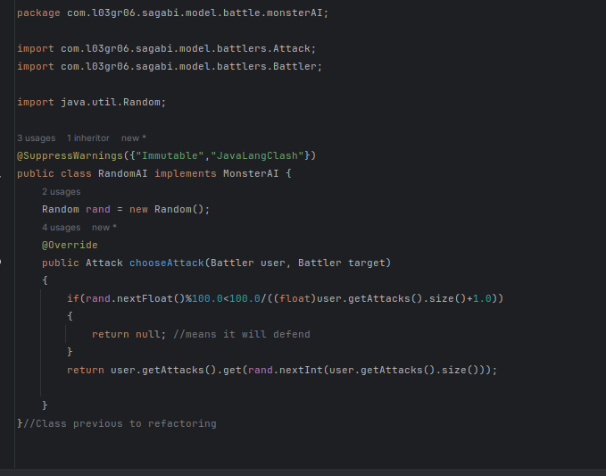

# LDTS_0306 - :sparkles:Warrior Princess Sagabi:sparkles:

This project is a game loosely inspired by Pókemon. In it our heroine, :sparkles:**Warrior Princess Sagabi**:sparkles:, defeats monsters that are terrorizing her kingdom and trying to take over her castle. With each monster she defeats, she gets more powerful and gains new abilities. Each ability has a specific associated Element. Her goal is to defeat as many enemies as possible without losing all her health and passing out.

This Project was developed by *Beatriz Ferreira* (up202205612@up.pt), *Gabriela Silva* (up202206777@up.pt) and *Sara Cortez* (up202205636@up.pt)

## GAME DESIGN
### FONT 
We used a square font and edited it using fontforge. Gabriela, with her dazzling art skills, volunteered to draw Sagabi and the Monsters. 

As we are programming using ASCII, each of the customized drawings has an associated character.

### ASCII BATTLE SPRITES

During the battle, you can see two ASCII sprites: the one on the bottom left is **Sagabi** and the one on the top right is the **Monster** she's fighting at the moment

### MAP DESIGN

The design of the map elements, such as the corridors and the room were done using _.txt_ files for each room (these can be found in src/main/resources/rooms) , where each ASCII character was mapped to a specific element.

This way, it is possible and easy to add different and more unique rooms to the game at any time.

## IMPLEMENTED FEATURES
### Start Menu

Allows user to choose between three different options:
- **Play** (accesses _Map_)
- **Learn** (accesses _Learn Screen_)
- **Exit** (exits and closes screen)

User is able to scroll through options using _up_ and _down_ arrows and hitting _enter_ to select a certain option.

The currently selected option shows up in a light blue color, while the remaining options are white.

### Map
*Corridor*

In the **corridor**, the heroine will be able to move around using the _arrow keys_. She will find herself in a castle hallway with several **doors** that lead into different rooms that she can enter. 

There are different types of rooms: **Monster Rooms** and **Healing Rooms**.

Doors that lead to **Monster Rooms** have a color that corresponds to the Monster's respective _Element_.

**Healing Room** doors are _white_ - but beware! There is a specific type of monster whose door is also white... it's a trap!

Rooms are entered by *colliding* with their respective doors.

*Healing Room*

In the healing room, the heroine will be able to **rest**. This will **increase her health levels**, so that she will be less likely to pass out in the following battles. Her **energy levels will also go up**, so that she can use stronger attacks.

*Monster Room*

When our heroine enters a Monster Room, the door will **lock** behind her. The only way to get out is by defeating the monster.

To defeat a Monster you must _fight it_. To start a **battle**, simply collide with the Monster sprite.

_Before defeating Monster_

_After defeating Monster_

### Battle

When a battle starts, the one who has the *highest speed level* attacks first.

*Heroine’s Turn*

When the heroine attacks, a *menu* will appear where the user will be able to pick what *action* is used. 

This selection is, similarly to the start menu, also done using *up* and *down* arrows to scroll through options and hitting *enter* to select.

The currently selected option will be _yellow_, and the remaining ones will be white.

The heroine will only be able to perform attacks that she has enough *energy* for and that will not consume her entire energy bar.

When she performs an attack, her *energy will go down*.

With each successful attack, the Monster’s health will decrease in accordance to the **effect** it has on him.

Along with attacks, the heroine will also be able to **defend** herself, possibly decreasing the monster’s attack effects the following turn.

If you so choose, you can also **rest**. This will make your energy go up, so you can perform stronger attacks.

If the heroine defeats the monster by effectively depleting its health or the monster runs out of energy, she will **go up a level** and will be sent back out onto the hallway.

*Monster’s Turn*

The monster's attack will be **selected by the program** taking into account its *Element*, *level*, and *energy*.

There is also a slight odd that the monster will choose to **defend** itself. 

The attack’s effect on the heroine’s health level will be displayed on screen. 

If the monster depletes it, the heroine will **pass out** and the **game will end**.

### Stats / Pause Screen

While playing, it is possible to **pause** the game by pressing select.

This must be done outside of the Main Menu or Battles.

When the game is paused, you can see your _Level_, your _Health_ and your _Energy_.

### Learn Screen

The *Learn Option* is a collection of text screens that describes the **game’s lore** and **how it is played**. 

It will detail to the user what rooms exist, what they are for, how to move around and how battles and gaining new abilities work.

### Heroine

The heroine, :sparkles:**Warrior Princess Sagabi**:sparkles:, is a **movable entity** when in the Map. 

She will show up as a sprite on the map and will **move** using the *arrow keys*. 

She **enters doors** by *colliding* with them - this happens when they are at the same position at the same time.

Inside of **Battles**, she remains **static** and is represented by an ASCII art drawing.

She has several **attributes**, namely:

- **Speed**

    Her speed will **increase along with her level**. As mentioned above, this will determine if she attacks first or not.

- **Level**

  Her level is determined by how many monsters she has defeated. She starts at level one and goes up one level with each successful encounter. 

  It **affects the energy levels** of the enemies she will combat and how **potent** their **attacks** are. It also determines how many **abilities** she has and how **powerful** they are.

- **Health**

    Health level starts at **max health** and goes down in accordance to each attack she suffers and its effects on her. If her energy level is depleted, she **passes out** and the **game ends**. The **user’s score** will be the **heroine’s level** at the time of passing out. Health level will go up when the *Healing Room* is entered.

- **Energy**

    The game starts with the heroine at **max energy**. The energy level **goes down** as she uses attacks. The **more powerful** an attack is, the **more energy** it will consume. If the heroine does not have enough energy to perform any attack during a battle, she can use the **Rest** option to fill up on energy with the downside of being more vulnerable during the following round. Energy level will also go up when the Healing Room is entered.

- **Abilities**

    The heroine starts out with a basic set of **generic abilities**. As she defeats more monsters, she will **gain more abilities**.

### Monsters

Monsters are **static** entities, represented by ASCII art when in Battle and by a text sprite when in the Monster Room. As well as the heroine, they also have **attributes**:

- **Speed**

    Its speed is **randomized** when the room is entered. As mentioned above, it will determine **who attacks first**.

- **Level**

    A monster’s level determines how **powerful** its attacks are. The level is **generated** when the player enters a room, taking into account the **player’s current level**.

- **Health**

    The monster’s health starts at **max health**. As the monster suffers attacks from the heroine, its health level will go down in accordance to how the attacks affect it. When the monster’s health bar is depleted, it is **defeated** and stops trying to conquer Sagabi’s castle.

- **Energy**

    Similarly to the heroine, the monsters also have an energy level. This will affect what kind of attacks they use and how powerful they are. Unlike the heroine, when the monster’s energy is **depleted**, it will not be able to keep defending itself - the **battle will end** and the monster is defeated. This prevents infinite battles.

- **Element**

    Each monster is associated with an **element**. This will determine what *type* of attacks they use.

### Elements

Elements are associated with **monsters** and **attacks**. 

As mentioned above, each *monster* has a specific associated element and its attacks are all of that very same element. 

*Attacks* have an associated element as well. 

The *heroine* will be able to have abilities related to every kind of element. 

The elements implemented in the game are:

- **Fire** :fire: (_red_)

- **Water** :ocean: (_dark blue_)

- **Air** :wind_face: (_beige_)

- **Earth** :mountain: (_brown_)

- **Lightning** :zap: (_yellow_)

- **Ice** :ice_cube: (_white_)

- **Paranormal** :ghost: (_gray_)

- **Poison** :skull: (_purple_)

## PLANNED FEATURES

### Battle

With a little more time, we would also like to refine the **balance** of battles, as it is too easy to defeat the monsters, especially in the lower levels.

### Game Design

We would've also liked to create better graphics for our game, namely when it comes to the ASCII drawings of monsters inside of Battles. 

### Sounds

Something we think would further enrich the gameplay is sounds/music that would make the playing experience more immersive. Due to time constraints, we didn't focus on this aspect.

## DESIGN
### Architecture

We are using a **Model View Controller** Architecture, expecting to divide src/main/java/com/l03g06/sagabi package into model, viewer, controller, gui and states packages. We ended up also adding a package for factories.

### Design Patterns

Little to no changes were made when it comes to the design patterns we used in relation to our intermediate delivery. That being said, the updates for this final delivery consist on updating the patterns to contain the expansions we had to make to our original UML. 

**Singleton**

It was decided to implement the Singleton design pattern for the **Game** and **PlayerBattler** classes. The Game class’ purpose is to run and stop the game, which only needs to happen once, and the PlayerBattler class’ purpose is to monitor and control the heroine’s actions during the battle - as there is only one player controlled by the user, there only need for there to be one instance of this class.

**Factory Method and Abstract Factory**(Class Integration)

We used different Factories to create the entity objects that are not Singletons.

The implemented factories dealt with the creation of *menus*, *rooms*, *attacks* and *monsters*.

**Composite**

The Composite design pattern was implemented in our **Viewer** and **Controller** classes. This was implemented so it is easier to represent new features/elements if so desired.

**Adapter**

The **GUI** interface and the **LanternaGUI** are instances of the Adapter pattern. It allows us to simplify Lanterna’s methods so that they can fulfill a set of methods that the remaining classes expect. If we wanted to change the game so that it used a different graphics and input library, all we would need to do is create a different class implementing the **GUI** interface.

**Command**

The Command design pattern was used in our **Controller** and **MenuOptionCommand** class. This way, it is simple to handle the user’s various requests while playing the game.

**Observer**

We implemented the Observer design pattern in our **Interactable** class. Objects of this class are kept in a separate list, which will be iterated by one of the components, in order to call a particular function in the event of the **Player** overlapping with them. 

**State**

This design pattern was used for our **State** and **BattleSubState** classes. Its purpose is to effectively control the game’s behavior depending on user choices.

## SOLID PRINCIPLES AND FILE DEPENDENCIES

Our design strategy was majorly guided by SOLID principles. We wanted to make sure that the code was suitable for extension and as efficient as it could be. Following these principles made the code easy to modify and extend whenever we figured out we needed to implement new Classes or features, so overall it had a really positive impact on our game's design and on the final outcome. 

Our design strategy was majorly guided by SOLID principles. We wanted to make sure that the code was suitable for extension, and if you noticed, iN some gif images uploaded in the previous section, you'll see a question mark in place of the monster image. We designed the code to take advantage of file reading, that is, all the rooms, monster elements, monsters, are constructed, in their factories, based on files in the resources directory. With the correct restricitons implemented in the logic, this can be a very powerful feature, since it allows for easy extension. The logic also considers invalid or absent (which one, depends on the context) file inputs, a manifestation of that part is that exact question mark.
For file reading, we added, in the directory main/java/factories a **ReadFile** class, designed to read files and return their contents in a list of strings. We chose to place this class in this package because most factories took advantage of it to simplify their functions.

Our resources folder has the following structure:
- **graphics** - a directory that contains the file with the color information for the elements, and the font we used in our game.
  

- **info** - this directory contains files like "Attacks.txt" for the **BasicAttackFactory** "Elements.txt" for the **BasicMonsterElementFactory** "MonsterImages.txt, which contains the ASCII art for the monsters and the heroine, and "Monsters.txt" for the **BasicMonsterFactory**. These files are used by the factories to construct the objects. It contains an explanation, for a reader of the code to understand what each piece of information means.
  
  
  

- **rooms** - this directory contains the files that describe the rooms. It is divided in three directories for each type of room, that is, **BattleRoom**, **HealRoom** and **Corridor**. Each file is named after the room it describes, and contains a matrix of characters, each one representing a different element. The rooms are constructed by the **BasicRoomFactory**. It also contains an explanation.
  
  
  
  

- **tests** - contains files to be used solely as testing resources.

## COMPLETE UML MODEL

Some changes and additions had to be made to the initial UML model in order to make the game function as expected. Some of these will be described below.

- A *factory* was added to generate attacks. This was done to aid the initialization of monsters and the player. It also allows for the randomization of attacks as the players reaches higher levels.

- **MonsterElementFactory** and **MainMenuFactory** were turned into interfaces. At first, their use was considered too trivial, but then it was decided that going about it in this way would allow for more complex implementation of each of these game elements.

- **MainMenuFactory** was made responsible for generating the Learn and Game Over menus so as to avoid having to include these elements in the initialization of the respective states.

- **ReadFile** class was added to aid in reading and parsing through files as needed. As we used files frequently to store information on room designs, attacks and elements, this was a big help and definitely necessary for a smooth coding experience.

- **BigLetters** class was added to separate static information about the initialization of the bigger letters of LanternaGUI. This had to be done so the LanternaGUI logic didn't get too long and complex.

- Some parameters of functions in **GUI/LanternaGUI** were altered so as to allow sprites to have different colors. Some additional functions were also implemented to easily draw strings and characters and initialize images for monster sprites.

- In the **DamageCalculator** class, functions were added that would affect Battler should it rest or its turn begin. The *useAttack* function also returns a string that describes what happened as the attack was used.

- New **BattleSubstates** were added, with the intention of not crowding a particular state.

- A function was added to **Battle** that allows for the player to return to the room where the battle started.

- A function was added to the **Attack** class to help with energy loss calculations.

- Functions were added to **Battler** to aid in correctly dealing with energy calculations and determining wins and losses.

- Added the capacity of associating **Elements** with color and the implications of a Monster being of a certain element on the damage they take from attacks.

- Added a static function **getStats** to **PlayerBattler** because the stats have to be created during the constructor and be passed to the constructor of the base class. This is only possible through a function that doesn’t depend on the particular variables of that particular object being created.

- Added new functions to **LearnStateMenu** that return relevant information to be used in the respective viewer

- Added refined win and loss functionalities to **BattleMenuCommands**.

- Added a **Pause** feature, which lead to the addition of several classes related to its implementation.

- Added new functions to the **Position** class that aided in the implementation of the Controllers.

- Getters were created inside of the **Game** class to obtain the instances of the factories that facilitate the creation of the model for each state.

## TESTING

In order to guarantee the correct functioning of the code we developed, we decided to use **Spock**, a testing and specification framework for *Java* and *Groovy* applications; **Pitest**, a mutation testing system for the *Java* virtual machine; **Mockito**, a mocking framework for unit testing in *Java*, and **jqwik**, a library which facilitates *property based testing*. **Property based testing** was used exclusively while testing our Position Class, as it is the only one that deals with numerical values. We strove to adhere to a **Test Driven Development** strategy. 
Additionally, we used the *errorprone* plugin in order to detect common pitfalls before they became too ingrained in our code. 

Although *errorprone* was very useful for assurance of good practice adoption, it raised some warnings that went beyond the project context, such as ClassLoader and Immutable warnings, which we silenced with the @SuppressWarnings annotation.

As of the development of the tests, the usage of jqwik was well-intended, however we ended up using it solely in one of the test classes, PositionTest.groovy. This owes to the fact that PBT is not so useful for checking whether the method calls were being made, if that was happening with the correct arguments, or state transitions as it is for testing arithmetical values. Besides, jqwik implied using JUnit instead of Spock, which was regarded as a major disadvantage. We believe that the tests we developed are sufficient to guarantee the correct functioning of our code. In the only other case, that required the testing of mathematical expressions, BattlerTest.java, we decided to use tables with different values for the arguments using a Boundary Testing strategy, instead of using jqwik.

Another problem we encountered was related to an incompatibility between Mockito, the framework we stated we would use for mocking, and Spock, the framework we used for testing. This incompatibility was related to the fact that Mockito uses cglib, which is not compatible with Spock and led to tests failing without any apparent logical reason. We tried to use the Mockito extension for Groovy (we were using the extension for Spock) but it didn't work either. The solution was, in the tests that showed this problem, to replace Mockito with Spock's own mocking framework. This was done in the tests for the GameOverController class.
We then decided it would be better to use Spock's mocking framework for all the tests that were not yet implemented, but in order to minimize workload, we decided to not change the tests that were already working with Mockito. One might look at this as a lack of consistency, but we believe that the tests are still understandable and that the usage of two different and independently running mocking frameworks is not a problem. Besides, this demonstrates our knowledge of both frameworks and adaptability.

Although some tests were certainly challenging, we strived to test as much of our code as possible, trying to leave only constructors, getters and other single-statement methods untested.
We reached a coverage percentage of 93%, as can be seen in the screenshots of the IDE and coverage report below.

Testing was a process that involved a lot of critical thinking and research of solutions. Some of the most challenging tests were the for the Doors, as you can see in the code snippets below.

We solved the BattleRoomDoorTest problem by adding a method to the Game Class, peekNextState(), in order to verify whether the transition of states was actually taking place and leading to the state the door was meant to lead.
We used @Unroll to go through all possible elements of a @Shared list, and testing the element factories in the way. This, however, does not compromise the unit testing we are making, since using a factory is just a restricted way of using a constructor. That justifies how, despite not having included one test for each factory class, we ended up with a high coverage on that part. 

As for Java structure, testing required us to use more getters and setters than we would have intended, as well as to make some methods public that would otherwise be private. In addition, we had to implement class constructors that were only used for testing purposes, which is not ideal. Nevertheless, one might look at that as a way to remove dependencies between classes and making the code more suitable for extension. LanternaGUI had its structure deeply affected by this approach that is, we were forced to add several constructors, and make most methods, initially thought as private, public.

This rethinking of the structure also involved atomizing our source code a little more, that is, breaking big functions into smaller pieces to make them more testable, which is a good practice in itself. A code snippet of a function that was broken down into smaller functions to make it more testable is displayed below.

_Before_

_After_

## BUILD AND DEPENDENCY MANAGEMENT
To promote a better organization of the development of this game, we opted to use git and its features in order to maintain parallel versions of the work. Namely, we kept different branches, which were updated at different rates. Each one of us worked in a personal branch, which would be frequently merged with a development branch. Once this development branch reached a satisfactory stage, it was merged with the main branch.
We used development as the place for the current, correctly-functioning code. As for main, we used it as a protected branch. Other branches like debug/spock-exception, debug/sneakythrow were created for specific purposes and were merged with development once they were no longer needed.
As for testing, revealed itself slightly useless due to the fact that the three of us were doing tests at the same time, and dealt with test pushing the same way we had dealt with regular code pushing.

## CODE SMELLS

- According to the *error-prone* plug-in, our use of String.split() has "unpredictable behavior". Despite this, we decided to maintain it as it is too vital for the functioning of our code.

- As mentioned above, some classes have methods and constructors that are only used for testing purposes.

- Controllers related to Menus use switch statements - this along with the use of the Action Enum and the limited number of viewers inside BattleViewer and RoomViewer can be considered an *Open-Closed Principle* violation.

- MenuOptionCommands have several dependencies

- Some BattleMenuCommands and BattleSubstates have long names

- Factories introduce plenty of fatal errors if paths aren't found correctly

- LanternaGUI is an extensive class

## COVERAGE REPORT

## FINAL DELIVERY

At the time of the Final Delivery, we aim for the main branch to contain:

- A folder, "docs", containing details from the UML diagram, screenshots of code, and screenshots and gifs of the gameplay.

- The gradle files, with the dependencies and plugins listed above.

- The code for our game, with all the classes related to its correct implementation.

- The tests we used to verify the correctness of our implementation.

- A complete description in the README.md file.

